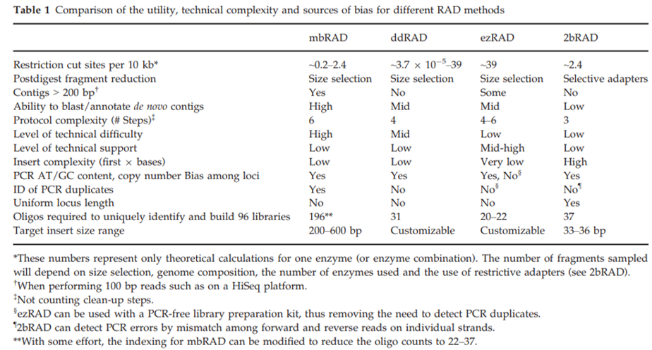
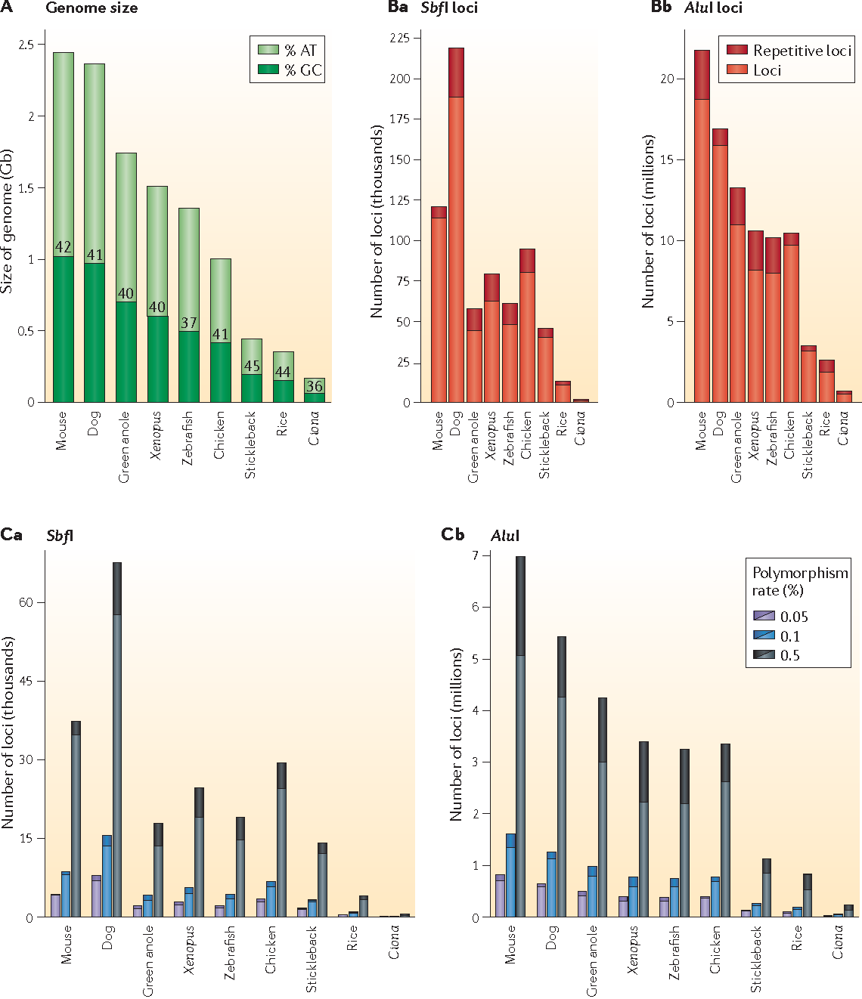

# RADseq para filogenias (laboratorio)

## 1. ¿Cuáles son las principales variantes del método de laboratorio para generar mis datos y cuándo es más útil cada una?
Al conjunto de métodos utilizados para secuenciar una reducida pero consistente representación del genoma se conoce como secuenciación de DNA asociado a sitio de restricción (RADseq) (Bleidorn, 2017). Se emplea endonucleasas de restricción, que son enzimas que reconocen un patrón específico de bases en las secuencias de DNA y fragmentan la doble hélice en sitios específicos de cuatro a ocho nucleótidos: las dianas de restricción. Esta capacidad de las endonucleasas de restricción para reconocer secuencias específicas de RADseq es la base de la técnica RADseq. 
Los marcadores RAD se implementaron por primera vez en 2007 usando microarreglos (Miller *et al*., 2007) y posteriormente en 2008 fueron adaptados para Next Generation Sequencing ( Baird *et al*., 2008; Bleidorn, 2017; ). En la actualidad el término RADseq se usa para describir varios métodos similares (Andrews *et al*., 2016, Bleidorn, 2017):

* **Original RAD**

* **2bRAD**

* **GBS**

* **ezRAD**

* **ddRAD**

*Los diferentes métodos de RADseq. Tomado de Andrews *et al*., 2016*

*Comparación entre diferentes métodos de RADseq. Tomado de  Puritz *et al*., 2014*

La secuenciación de genomas eucariontes completos para inferir filogenias sigue siendo costosa y lento. La secuenciación de genomas mitocondriales es más asequible, pero los árboles pueden ser engañosos debido a la introgresión y la heteroplasmia. Por lo tanto, los métodos RADseq parecen ser los más adecuados para generar reconstrucciones filogenéticas (Cariou *et al*., 2013, Cruaud *et al*., 2014). Por ejemplo en la siguiente figura podemos ver en la topología a partir de secuenciación Sanger posible introgresión (líneas punteadas) y algunos peines, además se observa que con el empleo de RADseq tan solo es aproximadamente tres veces más de tiempo y presupuesto a comparación con Sanger. 

 
*Filogenia obtenida de Cruaud *et al*., 2014*

## 2. ¿Qué limitantes y posibles fuentes de error puede presentar este método (en el laboratorio o la bioinformática)? ¿Qué puede hacerse para amortiguarlos?

* **DNA genómico de bajo peso molecular**

Una limitante es el DNA genómico de bajo peso molecular o degradado, ya que se requiere DNA genómico alto peso molecular (Andrews *et al*., 2016). Graham *et al*. (2015) encontraron que entre más degrado este el DNA se requieren más ciclos de PCR durante la normalización (para permitir la multiplexación) para compensar la menor cantidad de fragmentos intactos presentes, además mayor cantidad de DNA inicial. El aumento de los ciclos de PCR da lugar a una mayor proporción de fragmentos redundantes retenidos por la secuenciación, reduciendo el contenido de información para cada individuo. El DNA moderadamente degradado si puede ser utilizado de manera óptima, sin embargo, el DNA altamente degradado generalmente no aprueba los filtrados de calidad (Graham *et al*., 2015).

* **Inconsistencia en la selección del tamaño**

Para la mayoría de los protocolos, la digestión reduce el DNA genómico a un amplio rango de longitudes de fragmentos, y luego se usa un paso de selección de tamaño para aislar los fragmentos de longitudes ideales para la secuenciación. La consistencia en la selección de tamaño en las bibliotecas es crucial para producir datos de loci comparables en todas las muestras; la inconsistencia en la selección del tamaño  puede llevar a la aparición de diferentes conjuntos de loci en diferentes librerías, lo que da como resultado un esfuerzo de secuenciación desaprovechado y altos niveles de genotipos faltantes (Andrews *et al*., 2016).

* **Deserción de alelos y alelos nulos**

* **Duplicados de PCR y errores de genotipado**

Puritz *et al*. (2014) sugieren el uso de métodos “PCR-free” (ezRAD) para evitar duplicados de PCR. Estos métodos tienen un gran potencial, sin embargo son raramente factibles debido al alto costo por muestra y alta cantidad de DNA por muestra, excepto para las preguntas de investigación que se pueden responder utilizando muestras agrupadas (Puritz *et al*., 2014; Andrews *et al*., 2016)

* **Varianza en la profundidad de cobertura entre loci**

El promedio de cobertura de secuenciación por locus por individuo está dado por la siguiente fórmula: 

 
*Formula de la cobertura. Tomado de Cariou *et al*., 2013*

**R**: número total de reads, **N**: número de individuos incluidos en la librería, **Si**: número de sitios de restricción en el genoma del individuo **i**. 

Un incremento en el tamaño del pool ocasiona un un menor costo de secuenciación por muestra, pero ocasiona una menor cobertura por locus (Cariou *et al*., 2013).

* **Elección de la adecuada enzima de restricción**

Dependiendo de la pregunta de estudio se debe elegir la(s) enzimas(s). La elección de la enzima de restricción se basa en varios parámetros, como la frecuencia deseada de los sitios de RAD en todo el genoma, el contenido de GC, la profundidad de cobertura necesaria y el tamaño del genoma (Etter *et al*., 2011; Cariou *et al*., 2013). En la siguiente figura se puede observar que los diferentes grupos de organismos tienen distintos porcentajes de contenido de GC.

 
*Tomado de Davey *et al*., 2011*

Por ejemplo en un estudio filogenético de 12 especies de *Drosophila*, se determinó usar la enzima Sbf1, una enzima de corte raro debido a su sitio de restricción de 8 bp de longitud y rico en GC y por tanto cede en el menor número de sitios de restricción por genoma. Esta propiedad es valiosa para estudios donde una gran cantidad de especímenes son más importantes que una gran cantidad de loci por genoma (Cariou *et al*., 2013).

* **Tamaño de los reads**

En la siguiente figura se muestra la filogenia obtenida para doce especies de Drosophila realizada con reads de 100 pb, se observa una topología precisa. En contraste, también se realizaron pruebas filogenéticas con reads cortos (50 pb) y se encontraron errores (posición incorrecta de una especie) así como bajos soporte en los nodos más ancestrales. Este apoyo deficiente para los nodos profundos sugiere que los reads cortos deberían usarse para resolver filogenias de corta escala (Cariou *et al*. 2013).

 
*Filogenia de *Drosophila*. Tomado de Cariou *et al*., 2013*

## 3. ¿El muestreo requiere algún diseño específico? Por ejemplo, si se quiere secuenciar un genoma de novo ¿qué individuo sería ideal? Si trabajo con trascriptomas, ¿cómo afecta el tejido, la edad, las condiciones, etc. mi muestreo?

* **Se requiere DNA limpio, intacto y de alta calidad**

Es importante que el DNA tenga estas características para el éxito general del protocolo, así como para la óptima  digestión de endonucleasas de restricción. Se puede usar ADN de menor calidad, pero es probable que la cantidad inicial de DNA deba aumentarse. Se recomienda el kit DNeasy Blood & Tissue (Qiagen) o un kit/protocolo similar que produzca DNA puro, de alto peso molecular y libre de RNA (Etter *et al*., 2011).

Cuando trabajar con muestras de ADN muy degradadas es la única opción, se ha encontrado que los parámetros del protocolo se pueden optimizar (cómo usar más DNA de entrada para comenzar y un cizallamiento menor) para crear bibliotecas utilizables. Estas bibliotecas a menudo no se amplifican tan bien como las hechas con DNA genómico intacto de alto peso molecular  (Etter *et al*., 2011).

En la siguiente figura se muestran geles de agarosa de DNA de . En A es DNA extraído inmediatamente después de la toma de sangre. En B es DNA extraído inmediatamente después de la toma del tejido muscular. En C es DNA extraído de músculo después de 12 horas de incubación a temperatura ambiente. En D después de 48 horas de incubación y E después de 96 horas. Se puede observar que conforme mayor tiempo de incubación a temperatura ambiente, se obtiene DNA más degradado (Graham *et al*., 2015).

 
*Geles de agarosa de DNA. Tomado de Graham *et al*., 2015*

* **Cuantificación precisa de DNA**

Se recomienda utilizar un método basado en fluorescencia para la cuantificación de DNA para obtener las lecturas de concentración más precisas. Dado que se unen específicamente al ADN de doble cadena, los colorantes utilizados en los ensayos fluorométricos no se ven tan afectados por el RNA, nucleótidos libres u otros contaminantes comúnmente encontrados en las extracciones de DNA (lo que puede conducir a cuantificaciones inexactas cuando se usa la absorbancia). Si usa otra forma de cuantificación de DNA, como las lecturas de absorbancia del espectrómetro UV 260/280, se debe de confirmar la concentración comparando con una muestra de calibración conocida o procesando la muestra en un gel de agarosa y comparando una cantidad conocida de DNA o escalera (Etter *et al*., 2011).

Se recomienda verificar la integridad de las muestras en un gel independientemente del método de cuantificación. El ADN genómico debe consistir en una banda estrecha de alto peso molecular sin ningún tipo de visible
productos de degradación (Etter *et al*., 2011).

La concentración óptima es de 25 ng / μl o mayor (Etter *et al*., 2011).

**Literatura citada**

Andrews KR, Good JM, Miller MR, Luikart G, Hohenlohe PA (2016) Harnessing the power of RADseq for ecological and evolutionary genomics. Nat Rev Genet 17:81–92.

Baird NA, Etter PD, Atwood TS, Currey MC, Shiver AL, Lewis ZA, Selker EU, Cresko WA, Johnson EA (2008) Rapid SNP discovery and genetic mapping using sequenced RAD markers. PLoS One 3:e3376.

Bleidorn C. (2017) Phylogenomics. An Introduction. 1a edición. Springer. Spanish National Research Council. Madrid, España.

Cariou, M., Duret, L. & Charlat, S. (2013) Is RAD-seq suitable for phylogenetic inference? An in silico assessment and optimization. Ecol. Evol. 3, 846–852.

Cruaud, A. et al. (2014). Empirical assessment of RAD sequencing for interspecific phylogeny. Mol. Biol. Evol. 31, 1272–1274.

Davey, J. W. et al. (2011). Genome-wide genetic marker discovery and genotyping using next-generation sequencing. Nat. Rev. Genet. 12, 499–510.

Etter PD, Bassham S, Hohenlohe PA, Johnson EA, Cresko WA. (2011). SNP discovery and genotyping for evolutionary genetics using RAD sequencing. In: Orgogozo V, Rockman MV, editors. Molecular methods for evolutionary genetics. New York: Humana Press. p. 157–178.

Graham, C. et al. Impacts of degraded DNA on restriction enzyme associated DNA sequencing (RADSeq). (2015). Mol. Ecol. Resour. 15, 1304–1315.

Miller, M. R., Dunham, J. P., Amores, A., Cresko, W. A. & Johnson, E. A. (2007). Rapid and cost-effective polymorphism identification and genotyping using restriction site associated DNA (RAD) markers. Genome Res. 17, 240–248. 

Puritz J. B., Matz M. V., Toonen R. J., Weber J. N., Bolnick D. I., Bird C. E. (2014) Demystifying the RAD fad. Molecular Ecology 23, 5937–5942.